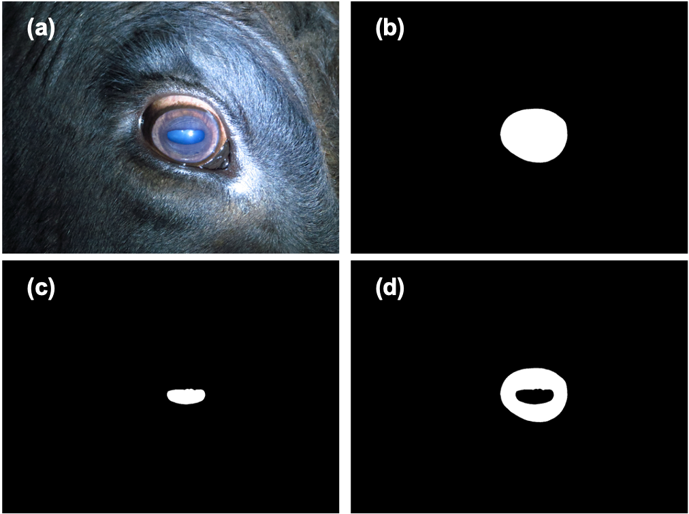
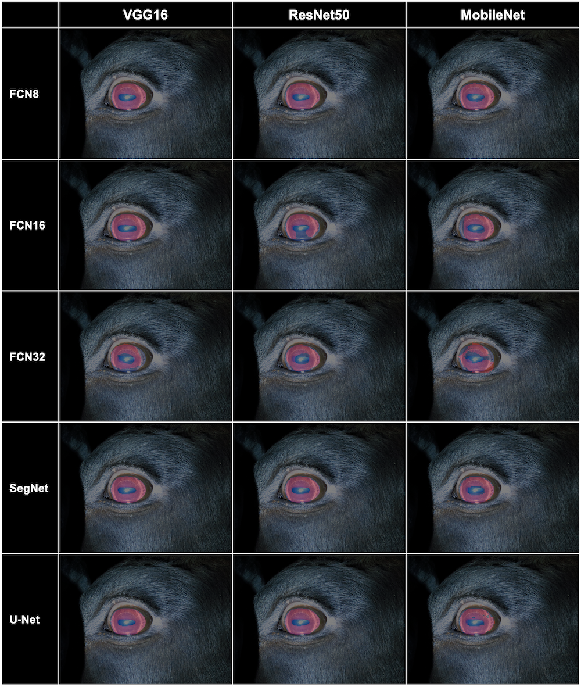

# Bovine IRIS Image Segmentation with Keras

## Introduction

 In this study, we elaborate on bovine iris segmentation. We will develop multiple segmentation models by training publicly available bovine iris datasets, BovineAAEyes80 (Larregui, Cazzato & Castro, 2019), and comparing combinations of the state-of-art deep learning techniques. Since iris datasets are rare and limited in their format like other biometric datasets, we propose a framework enabling us to develop models using minimum input datasets: region of interests (ROIs) labels and RGB images. This study will not only contribute to the advancement of iris identification using DNNs but also to the development of a reliable DNNs training framework assisting decision making of the most suitable combination of DNNs models for biometric images. 

## Data overview
 
FIGURE 1. The number of image per animal is varied for each entity from 1 to 13.
  

 

 FIGURE 2. (a) Original RGB image of bovine eye. (b) Outer bound annotation which includes iris and pupil. (c) Inner bound annotation which indicates pupil. (d) Region of Interest (ROI) annotation which includes iris and excludes pupil. 

  

 
TABLE 1. Distribution of the dataset for 5-fold cross validation
  

## Training scheme
 

 FIGURE 3. Scheme of model training for selection of the best combination of segmentation models for biometric images. (a) Biometric images are collected and captured. The images’ mask annotation data is created or collected from data sources. (b) Images are split into training, validation and test datasets. Augmentation techniques can be selected and adapted within the framework according to the traits of the image. (c) 5 DNNs – FCN32, FCN16, FCN8, U-Net and SegNet – are trained and compared with 3 different backbones for each training to select the most reliable model. After training 15 combination models, evaluation is conducted with unseen test dataset. 

  

## Training result
 
FIGURE 4. Learning curve of training process
  

 
FIGURE 5. Visible result of training (with validation set)
  

## Test result 
 
TABLE 3. Test result of the trained models with **unseen test dataset**. 
  

 
TABLE 4. Inference time comparison of trained models with **unseen test dataset**.
  

## Things to discuss
 

FIGURE 6. Comparison of segmentation performance in the unit of pixels. You can see U-Net with MobileNet (right) has bigger unit of pixels for segmentation.

  

 

 FIGURE 7. Common corruptions in iris image. (a) Minor corruption caused by an eyelash over the eye. The eyelash made shadow in iris area (yellow arrow). In addition, the eyelash itself covers minor part of iris and pupil. (b) Major corruption caused by eyelashes which cover most part of upper iris. The corruption makes it difficult to identify the area. (c) Segmentation result does not reflect the minor corruption in the iris. (d) Even though the annotation masks used in training the model does not exclude eyelashes from the iris area, the trained model successfully segmented iris area excluding eyelashes. 

  

## Further Things to do
* classification of entity
* post-processing of iris area (make flat image)
* decoding iris characteristics with low resolution

## System Utilized
- CPU : AMD EPYC Rome 7352 2P 24-Core CPU 2.3GHz 
- GPU : NVIDIA A40
- Ubuntu : 20.04.5 LTS (GNU/Linux 5.4.0-131-generic x86_64)
- CUDA : 11.5
- Conda : 4.8.3
- Python : 3.9.15

## packages in virtual environment
- numpy==1.23.5
- nvidia-cudnn-cu11==8.5.0.96
- opencv-python==4.6.0.66
- pandas==1.5.2
- Pillow==9.3.0
- Keras==2.4.3
- imgaug == 0.4.0

## Full Paper
* https://arxiv.org/abs/2212.11439

## Reference
* code base : https://github.com/divamgupta/image-segmentation-keras
* dataset : J. I. Larregui, D. Cazzato, and S. M. Castro, "An image processing pipeline to segment iris for unconstrained cow identification system," Open Computer Science, vol. 9, no. 1, pp. 145-159, 2019.
